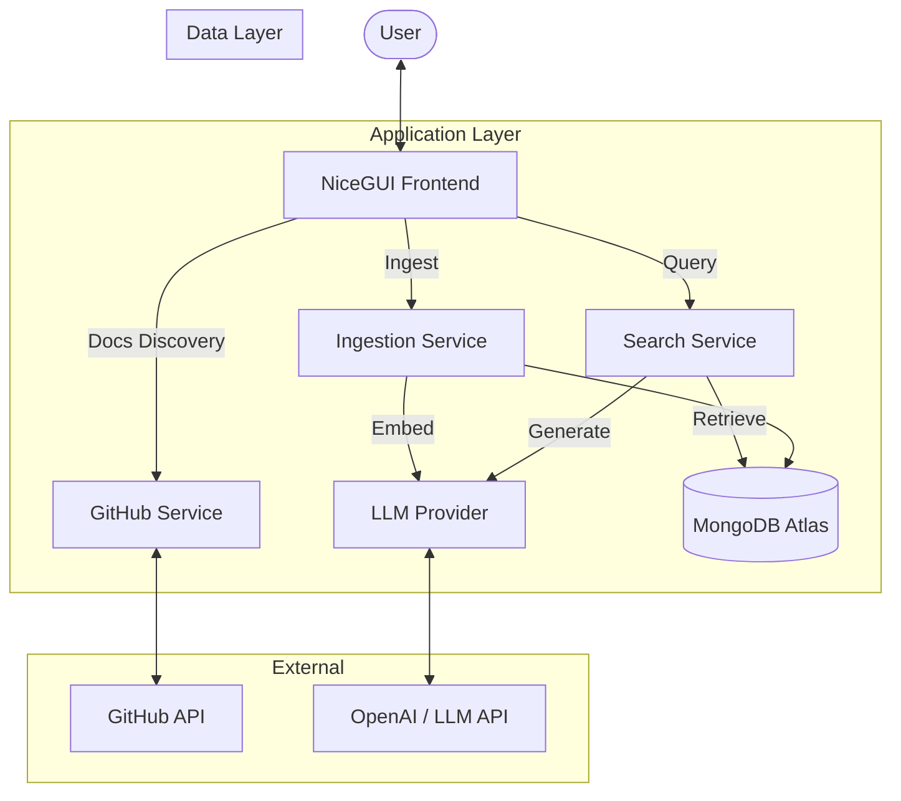

# Repo-MCP: Repository Documentation RAG System


Repo-MCP is a **NiceGUI-based application** designed to ingest GitHub repository and enable interactive Q&A using Retrieval Augmented Generation (RAG).

## 🚀 Features

*   **Ingestion**: Fetch and ingest Markdown files (`.md, .py, .js, .ts, .html, .css, .json, .yaml, .yml`) directly from GitHub repositories.
*   **Query**: Ask questions about the ingested documentation using an AI assistant powered by LlamaIndex (gemma-2.0-9b).
*   **Management**: View repository statistics and delete ingested data.
*   **API**: Direct access to GitHub file tools for inspection.
*   **Modern UI**: Built with NiceGUI for a clean, responsive, and interactive experience.

## 🏗️ Architecture

The system follows a modular architecture separating the UI, business logic, and data layers.

### High-Level Flow



### Components

1.  **Frontend (`app/main.py`)**:
    -   Built with **NiceGUI**.
    -   Handles user inputs (repo URLs, queries).
    -   Displays ingestion progress and chat interface.
    -   Manages asynchronous tasks for non-blocking UI.

2.  **Services**:
    -   **GitHub Service** (`app/services/github.py`): Fetches raw file content and metadata from GitHub repositories.
    -   **Ingestion Service** (`app/services/ingestion.py`): Orchestrates the RAG pipeline.
        -   Converts text to vectors using the Embedding Model.
        -   Stores vectors and metadata in MongoDB.
    -   **Search Service** (`app/services/search.py`):
        -   Performs semantic search on the Vector Store.
        -   Constructs prompts and retrieves answers from the LLM.

3.  **Data Layer (`app/db`)**:
    -   **MongoDB Atlas**: Acts as both the Vector Store (using `MongoDBAtlasVectorSearch`) and the metadata storage.
    -   **LlamaIndex**: Provides the abstraction for Vector Stores and RAG workflows.

## 📂 Project Structure

```text
repo_mcp/
├── app/
│   ├── core/           # Configuration settings
│   ├── db/             # Database connections (MongoDB/Vector)
│   ├── llm/            # LLM & Embedding client factories
│   ├── models/         # Data models
│   ├── repositories/   # CRUD operations for metadata
│   ├── services/       # Core business logic (GitHub, Injest, Search)
│   └── main.py         # Application entry point & UI
├── .env.sample         # Template for environment variables
└── requirements.txt    # Project dependencies
```

## 🛠️ Prerequisites

*   **Python**: 3.8+
*   **GitHub API Token**: Optional, but recommended to avoid rate limits when fetching files.
*   **LLM Provider API Key**: e.g., NebiusLLM API Key, to power the RAG system.

## 📦 Installation

1.  **Clone the repository:**
    ```bash
    git clone https://github.com/your-username/repo_mcp.git
    cd repo_mcp
    ```

2.  **Create and activate a virtual environment:**
    ```bash
    python -m venv .venv
    # Windows
    .venv\Scripts\activate
    # macOS/Linux
    source .venv/bin/activate
    ```

3.  **Install dependencies:**
    ```bash
    pip install -r requirements.txt
    ```

## ⚙️ Configuration

1.  Copy the sample environment file:
    ```bash
    cp .env.sample .env
    ```

2.  Edit `.env` and add your API keys:
    ```env
    # Example .env content
    GITHUB_API_KEY=your_github_token
    # Add other necessary variables
    ```

## 🏃‍♂️ usage

1.  **Start the application:**
    ```bash
    python app/main.py
    ```

2.  **Open your browser:**
    Navigate to `http://localhost:8000` (or the port specified in the console).

3.  **Ingest a Repository:**
    *   Go to the **Ingestion** tab.
    *   Enter a GitHub repository URL (e.g., `owner/repo`).
    *   Click **Discover Docs**.
    *   Select the files you want to index and click **Start Ingestion**.

4.  **Ask Questions:**
    *   Switch to the **Query** tab.
    *   Select the repository you ingested.
    *   Type your question in the chat input and get answers based on the documentation!

## 🤝 Contributing

Contributions are welcome! Please feel free to submit a Pull Request.

## 📄 License

This project is licensed under the MIT License - see the [LICENSE](LICENSE) file for details.


